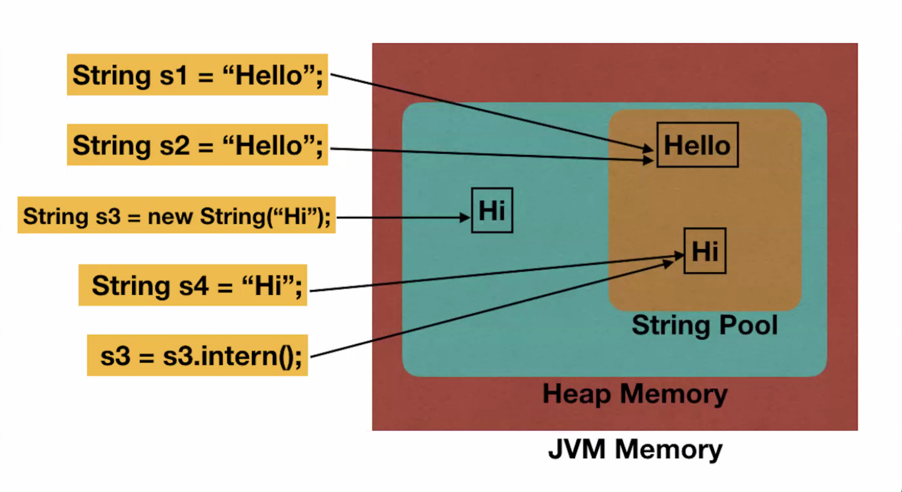
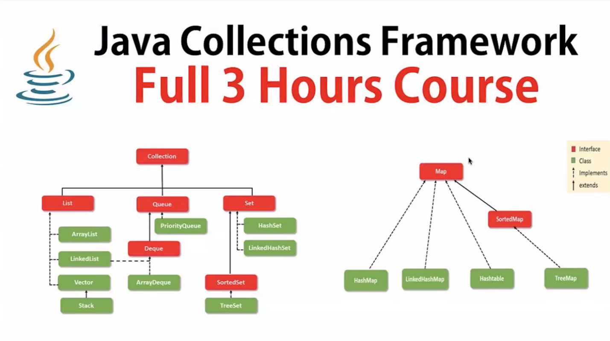
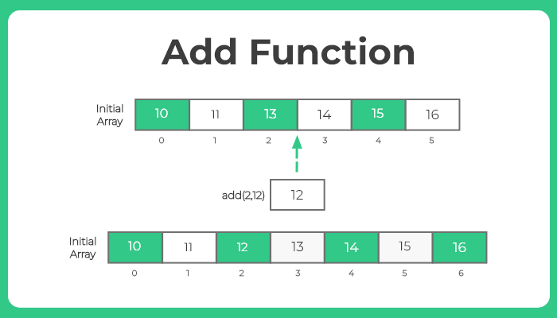
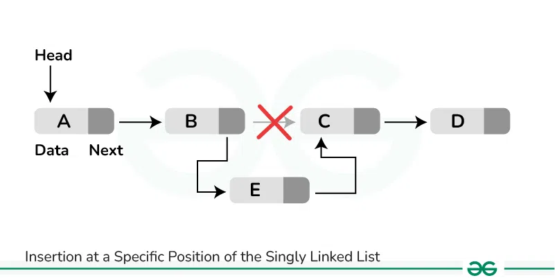

- Java'da String'ler değiştirilemez (immutable).  Herhangi bir değişiklik yapıldığında yeni bir String oluşturulur.
- equals ile değişken değerini kontrol ederiz
    
    
  
    
- new ile oluşturduğumuzda her zaman yeni nesne oluşturulur.
- Hafızada aynı değere sahip bir `String` varsa, mevcut değere referans verilir ve yeni bir nesne oluşturulmaz.
- String üzerinde değişiklik yapmak istiyorsak ve hafıza alanının değişmesini istemiyorsak, `StringBuilder` veya `StringBuffer` kullanabiliriz.
- Nesne değişkenleri, bir sınıfın içinde tanımlanan ve o sınıftan oluşturulan her nesne için ayrı bir değere sahip olan değişkenlerdir.
- Yerel değişkenler, bir metodun içinde tanımlanan ve sadece o metodun kapsamı içinde geçerli olan değişkenlerdir.
- Java'da erişim belirleyicileri (access modifiers), bir sınıfın, metodun veya değişkenin (field) erişim düzeyini kontrol eder.
    - **public**: Her yerden erişilebilir.
    - **private**: Sadece tanımlandığı sınıf içinde erişilebilir.
    - **protected**: Aynı paket ve alt sınıflar tarafından erişilebilir.
- Statik Değişkenler (Class Variables): Statik değişkenler, bir sınıfın tüm nesneleri için ortak bir değeri temsil eder. Herhangi bir nesne oluşturulmadan önce sınıf düzeyinde tanımlanabilir. Statik değişkenlere, sınıf adı ile erişilir.

```java
class Araba {
    static int arabaSayisi = 0; // Statik değişken

    public Araba() {
        arabaSayisi++; // Yeni bir Araba nesnesi oluşturulduğunda sayıyı artır
    }
}

public class Main {
    public static void main(String[] args) {
        Araba araba1 = new Araba(); // arabaSayisi 1 olur
        Araba araba2 = new Araba(); // arabaSayisi 2 olur

        System.out.println("Toplam Araba Sayısı: " + Araba.arabaSayisi); // Çıktı: 2
    }
}
```

- Nesne değişkenleri, bir sınıfın her nesnesi için ayrı bir değere sahip olan değişkenlerdir. Sınıf düzeyinde tanımlanır, ancak nesneye bağlıdır. Nesne değişkenlerine, o sınıfın nesnesi üzerinden erişilir.

```java
class Araba {
    String renk; // Nesne değişkeni

    public Araba(String renk) {
        this.renk = renk; // Yapıcı metod ile nesne değişkenine değer atama
    }
}

public class Main {
    public static void main(String[] args) {
        Araba araba1 = new Araba("Kırmızı"); // araba1 nesnesi
        Araba araba2 = new Araba("Mavi");    // araba2 nesnesi

        System.out.println("araba1'in rengi: " + araba1.renk); // Çıktı: Kırmızı
        System.out.println("araba2'nin rengi: " + araba2.renk); // Çıktı: Mavi
    }
}
```

- `static`, veri paylaşımını ve belirli işlemlerin sınıf düzeyinde yönetilmesini sağlamak için önemli bir araçtır.

## ***Collections***
-  
  

### ArrayList

- Eleman ekledikçe boyutunu otomatik olarak artırır. Bu, sabit boyutlu dizilerin aksine daha esnek bir yapı sağlar.
- Kolay eleman ekleme/çıkarma ve hızlı rastgele erişim özellikleri ile güçlü bir koleksiyon yapısıdır. Ancak, sıklıkla ekleme ve çıkarma yapılacaksa, `LinkedList` daha uygun bir seçenek olabilir.
    
	
    
- ArrayList<Object> olarak tanımlanırsa farklı türdeki nesneleri alabilir.
- ArrayList<String> olarak tanımlanırsa sadece String türünde nesne eklenir.
- Aynı nesneden ekleme yapılabilir. Farklı index’de tutulur.

### LinkedList

- Her bir elemanın (düğüm) bir sonraki ve bir önceki düğümün referansını içerdiği bir yapıdadır. Bu sayede elemanlar arasında hızlı geçiş yapılabilir.
- Eleman sayısı dinamiktir.
- `LinkedList`, dinamik boyut, hızlı ekleme/çıkarma işlemleri ve bağlantılı düğüm yapısı ile güçlü bir koleksiyon yapısıdır. Ancak, rastgele erişim ihtiyacı varsa `ArrayList` daha iyi bir seçenek olabilir.
    
    
	
    

### HashSet

- İçindeki öğelerin benzersiz olmasını garanti eder. Yani, aynı değeri taşıyan iki öğe eklenemez.
- Yalnızca bir adet `null` öğe içerebilir.
- Tekrar eden öğeleri önlemek için idealdir.

### HashMap

- Anahtar-değer (key-value) çiftlerini depolar. Anahtarlar benzersiz olmalıdır, ancak değerler aynı olabilir.
- Elemanları sırasız bir şekilde depolar. Yani, ekleme sırasına göre anahtarlar üzerinde herhangi bir düzen garantisi yoktur.
- Anahtarları depolamak için hash kodlarını kullanır. Her anahtarın hash kodu hesaplanır ve bu hash kodu, anahtarın `HashMap` içinde depolanacağı yeri belirler.