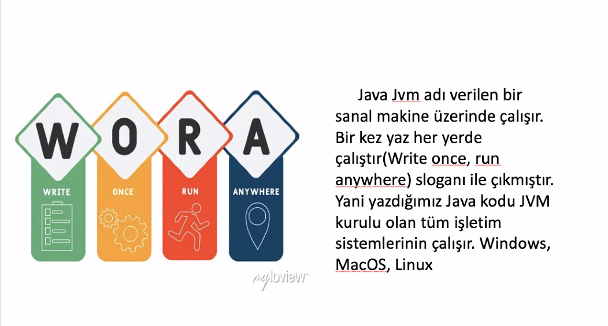
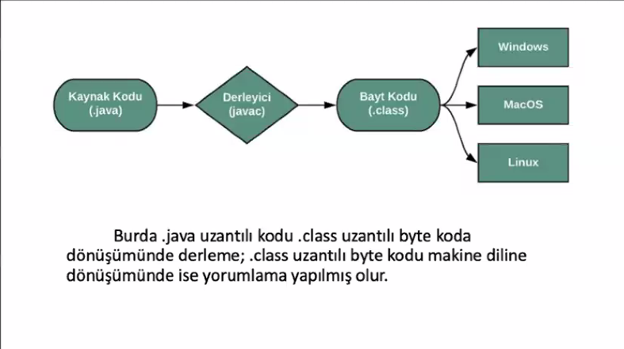
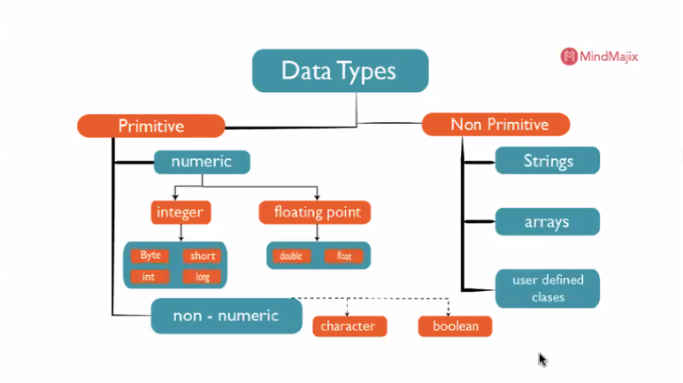
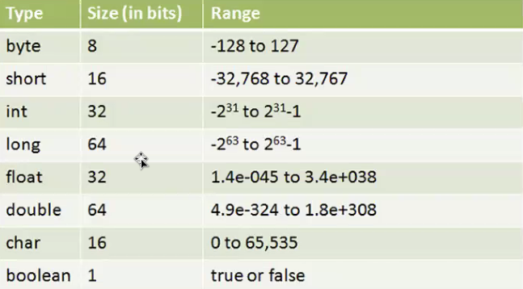
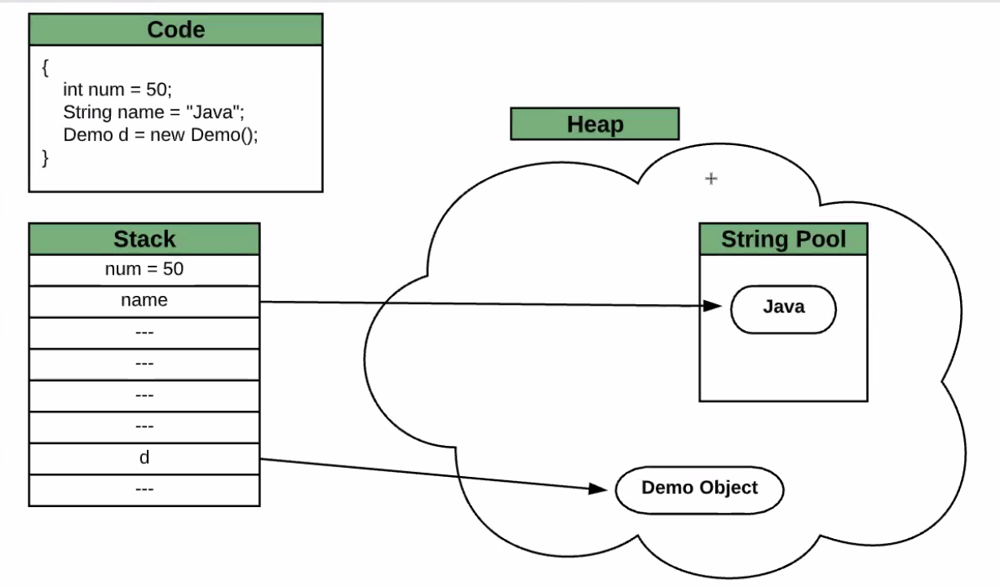

## ***Java Temelleri***

- Java, JVM (Java Virtual Machine) üzerinde çalıştığı için platform bağımsız ve taşınabilir bir dildir.
    

    
	
  
    
- Java kodları doğrudan makine koduna çevrilmez, JVM üzerinde çalıştırılır.

### JVM, JRE ve JDK

- Programcı, Java dilinde bir kaynak kod dosyası (.java) yazar.  Java derleyicisi (`javac`) kullanılarak kaynak kod derlenir. Bu işlem, `.java` dosyasını bayt kodu içeren `.class` dosyasına dönüştürür. JVM (Java Virtual Machine), bayt kodunu alır ve çalıştırır. Bu aşamada, JVM bayt kodunu makine koduna dönüştürür ve program çalıştırılır.

 
	
 

- Java kodları hem derlenir (compiled) hem de yorumlanır (interpreted). Bu sayede farklı platformlarda çalışabilir.
- JVM → JRE → JDK (içten dışa doğru)
- ***JVM* (Java Virtual Machine)**: Java programlarının çalıştırıldığı sanal bir makinedir.  Bayt kodunu alır ve onu makine koduna çevirir, ardından çalıştırır.
- ***JRE* (Java Runtime Environment)**: Java uygulamalarının çalışması için gerekli olan ortamı sağlar. JRE, JVM'i içerir ve ek olarak kütüphaneler, sınıf dosyaları ve diğer gerekli bileşenleri barındırır.
- ***JDK* (Java Development Kit)**:  Java geliştirme kitidir ve Java uygulamalarını geliştirmek, derlemek ve çalıştırmak için gerekli olan tüm araçları içerir. JDK, JRE'yi içerir ve ek olarak geliştiricilerin ihtiyaç duyduğu araçları barındırır.

## ***Java’da Veri Tipleri***
-
	
  

 - ***Primitive Types (İlkel Veri Tipleri):***
    
    Primitive veri tipleri, Java'da en temel veri tipleridir. Basit veri tipleri olarak bilinirler ve çeşitli fonksiyonları yoktur.
    
    *ÖRN*:  byte, short, int, long, float, double, char,boolean.
    
    (id’ler long olarak tanımlanır)
    
 - ***Non-Primitive Types (Referans Veri Tipleri):***
    
    Non-primitive veri tipleri, daha karmaşık veri tipleridir ve çeşitli fonksiyonları vardır. 
    
    *ÖRN: String, Array, Class*
    
   
	

    
    Java'da `int` veri tipi 32 bittir ve değeri -2^31 ile (2^31)-1 arasındadır. Bu aralık, toplamda 2^32 farklı değer içerir. Bu aralığın hesaplanma mantığı şu şekildedir:
    `int` veri tipinde 1 bit işaret biti olarak kullanılır. Bu bit, sayının pozitif mi yoksa negatif mi olduğunu belirler.
    Geriye kalan 31 bit ise sayının büyüklüğünü temsil eder.
    Pozitif sayılar için aralık 0'dan başlar, bu yüzden pozitif sayılar için en yüksek değer 2^31 - 1 olur.
    Negatif sayılar için en düşük değer -2^31 olur.
    

### Değişkenler ve Bellek Yönetimi

- **Stack**:
    - Primitive veri tipleri genellikle stack bellekte saklanır.
    - Stack, hızlı erişim sağlamak için kullanılır ve metod çağrıları sırasında oluşturulan yerel değişkenler burada saklanır.
    - Stack bellek, metod tamamlandığında otomatik olarak temizlenir.
- **Heap**:
    - Non-primitive veri tipleri heap bellekte saklanır.
    - Heap, daha büyük ve dinamik bellektir ve runtime sırasında nesneler burada oluşturulur.
    - Heap bellekteki nesneler, uygulama tarafından erişildiği sürece varlığını sürdürür. (mainin yaşam döngüsü bitse bile hafızada kalmaya devam ediyor)
    - Java, kullanılmayan nesneleri otomatik olarak temizlemek için Garbage Collector kullanır.
- **Garbage Collector(Çöp Toplayıcı):** heap bellekteki kullanılmayan nesneleri otomatik olarak temizler.
    

	

    
- Java'da tüm argümanlar değer olarak geçirilir.(Pass by Value)
- **Boxing**: Primitif `int`'in `Integer` nesnesine dönüşmesi.
- **Unboxing**: `Integer` nesnesinin primitive `int` değerine dönüşmesi.
- `==` operatörü, iki referansın bellek adreslerini (yani nesnelerin bellek içindeki yerlerini) karşılaştırır, değerlerini değil.
