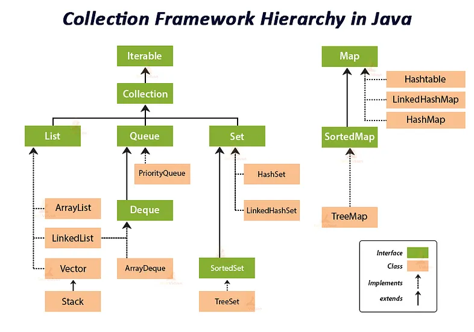

# COLLECTIONS FRAMEWORK

 Collection, **Interface** olup içinde benzer türden nesneleri belirli şekilde tutacak, nesnelere ait temel davranışları belirler.

<p align="center" style="padding: 10px">



 Collection Interface’e ait özellikler;

- **int size() :** Collection içerisinde bulunan elemanların sayısını verir.
- **boolean isEmpty() :** Collection içerisinde eleman yoksa **true** değerini return eder.
- **boolean contains(Object element) :** Parametre olarak verilen eleman Collection içerisinde mevcutsa **true** değerini dönderir.
- **boolean add(Object element) :** Collection yapısına object ekler .
- **boolean remove(Object element):** Collection yapısından object remove eder .
- **boolean containsAll(Collections<E> c) :** Bulk bir işlemdir . Verilen obje listesinin collection içerisinde var olup olmadığını kontrol eder.
- **boolean addAll(Collections<E> c) :** Parametre olarak verilen listeyi toplu olarak collection içerisine ekler.
- **boolean removeAll(Collections<E> c) :** Parametre olarak verilen liste içerisindeki elemanları collection içerisinden remove eder.
- **boolean retainAll(Collections<E> c) :** Parametre olarak verilen liste ile collection içerisindeki elemanları aynı tutar . Yani parametre olarak verilen listede olmayan elemanlar collection içerisinde çıkartılır.

## 1. Set<E>

### **HashSet<E>**

HashSet<E>’te veriler hashleme yöntemi ile tutulur. Verilerin sırasının korunacağını garanti etmez. İçinde bulunan öğelerin benzersiz olmasını sağlar. Aynı öğe iki kez eklenemez.

```java
package org.example.set;

import java.util.HashSet;

public class HashSetExample {
    public static void main(String[] args) {
        HashSet<String> fruits = new HashSet<String>();

        fruits.add("apple");
        fruits.add("orange");
        fruits.add("banana");

        //Aynı elemandan bir tane daha eklemeye çalışıyoruz.
        fruits.add("apple");

        //İki tane null eklemeye çalışıyoruz.
        fruits.add("null");
        fruits.add("null");

        System.out.println("HashSet: " + fruits);
    }
}

```

### LinkedHashSet<E>

Veriler ekleme sırasına göre tutulur. Tekrarlı element geldiğinde ilk eklenen element bundan etkilenmez. İçinde bulunan öğelerin benzersiz olmasını sağlar. Aynı öğe iki kez eklenmez.

```java
package org.example.set;

import java.util.LinkedHashSet;

public class LinkedHashSetExample {
    public static void main(String[] args) {
        LinkedHashSet<String> days = new LinkedHashSet<>();
        days.add("Monday");
        days.add("Tuesday");
        days.add("Wednesday");
        days.add("Thursday");
        days.add("Friday");
        days.add("Saturday");
        days.add("Sunday");

        //Aynı elemanı tekrar kaydetmeyi deniyelim.
        // Tekrarlı element sıralamayı değiştirmeyecek
        days.add("Monday");

        //null eleman ekleyelim.
        days.add("null");

        System.out.println("days : " + days);
    }
}
```

### TreeSet<E>

TreeSet’lerde elementler artan sıralamayla, yani ascending order ile tutulur. Null değer kabul etmez, hata verir (NullPointerExeption). İçinde bulunan öğelerin benzersiz olmasını sağlar. Aynı öğe iki kez eklenmez.

```java
package org.example.set;

import java.util.TreeSet;

public class TreeSetExample {
    public static void main(String[] args) {
        TreeSet<Integer> numbers = new TreeSet<>();
        numbers.add(1);
        numbers.add(2);
        numbers.add(3);
        numbers.add(4);

        //Tekrarlı eleman eklemeye çalışalım. 
        //Sıralamyı değiştirmeyecek.
        numbers.add(3);

        // numbers.add(null);

        System.out.println("numbers: " + numbers);

    }
}
```

## 2. List<E>


List’in karakteristik özellikleri tekrarlı elementlere izin vermesi, elementleri ekleme sırasına göre tutması ve istediğimiz index’e element eklememize izin vermesidir.

### ArrayList<E>

ArrayList sınıfı öğeleri depolamak için dinamik bir dizi kullanır. Normal bir dizi gibidir fakat boyut sınırı yoktur. İstenildiği zaman öğe eklenir veya öğe silinebilir. Birbirini tekrar eden ve boş değerleri içerebilir, sıralı bir koleksiyondur ekleme sırasını korur. Öğelere erişim ve değiştirme işlemlerinde hızlıdır. Ancak, öğe ekleme ve silme işlemleri öğelerin kaydırılmasını gerektirdiğinden, performans eklenen veya silinen öğelerin konumuna bağlı olarak değişebilir.

```java
package org.example.list;

import java.util.ArrayList;

public class ArrayListExample {
    public static void main(String[] args) {

        ArrayList<String> cities  = new ArrayList<>();
        cities .add("New York");
        cities .add("San Francisco");
        cities .add("Belgium");

        System.out.println("citys: " + cities );

        // Liste boyutunu yazdırma
        System.out.println(cities.size());

        // Belirli bir index'e erişim
        System.out.println(cities.get(0));

        // Bir öğeyi değiştirme
        cities .set(2, "Paris");

        // Bir öğeyi silme
        cities .remove(0);
        
        cities.add(null);
        System.out.println(cities );
    }
}
```

<aside>
💡 List<Integer> example= new ArrayList<>();
Bu kullanım farkı nedir?

</aside>

### LinkedList<E>

LinkedList, öğeleri depolamak için dinamik bir dizi kullanır. Normal bir dizi gibidir fakat boyut sınırı yoktur. İstenildiği zaman öğe eklenir veya öğe silinebilir. Her öğenin kendisinden önceki ve sonraki öğeye işaret ettiği çift yönlü bağlı liste veri yapısını kullanır. Öğeleri eklenme sırasına göre saklar. Index’ler aracılığıyla öğelere erişim sağlar. Birbirini tekrar eden ve boş değerleri içerebilir.

```java
package org.example.list;

import java.util.LinkedList;

public class LinkedListExample {
    public static void main(String[] args) {
        LinkedList<String> movies = new LinkedList<>();
        movies.add("Harry Potter");
        movies.add("The Lord of the Rings");
        movies.add("The Hobbit");

        // Liste boyutunu yazdırma
        System.out.println(movies.size());

        // Belirli bir index'e erişim
        System.out.println(movies.get(2));

        // İstediğimiz index'e eleman ekleme
        movies.add(2, "Before Sunrise");

        // Bir öğeyi silme
        movies.remove(0);

        movies.add(null);
        System.out.println(movies );
    }
}
```

<aside>
💡 Arama işlemlerinde LinkedList O(n) iken ArrayList’te O(1)’dir. Silme işlemlerinde ise ArrayList O(n) iken LinkedList O(1)’dir. Ekleme işlemleri de aynı sonuçları verir. Dolayısıyla eğer ekleme ve silme işlemleri sık yapılacaksa LinkedList kullanmak daha avantajlıdır. Arama işlemleri sık yapılacak ise de ArrayList daha avantajlıdır.

</aside>

### Vector<E>

Vector, nadiren kullanılan bir classtır. Boyutunu otomatik olarak yönetir. Bir öğe eklendiğinde kapasitesi otomatik olarak genişler. Index’ler aracılığıyla belirli bir konumdaki öğelere hızlı erişim sağlar.  Kapasitesini otomatik olarak büyütürken, varsayılan olarak iki katına çıkar. Ancak, isteğe bağlı olarak büyüme faktörü belirlenebilir.

## 3. Map <K, V>


Map interface’i collection sınıfına dahil değildir fakat benzer amaçlar taşıdığı için aynı başlık altında öğretilir. Map’ler eşleme tablolarıdır. Bir Map’te tekrarlı key olamaz. Tüm value’lar bir key ile eşlenir ve bu key ile çağrılır.

### HashMap<K, V>

HashMap, her anahtar için benzersiz bir değer saklar. Anahtarlar benzersiz olmalıdır, ancak değerler aynı olabilir. HashMap, hızlı erişim sağlamak için bir karma tablosu (hash table) kullanır. Anahtarlar, hashCode() metoduyla bir karma değere dönüştürülerek dizi indekslerine dönüştürülür. Bu sayede anahtarlarla ilişkili değerlere doğrudan erişilebilir.

HashMap, null değerlerin ve null anahtarların kullanımına izin verir. Ayrıca, dinamik bir boyuta sahiptir. Eklenen çiftlerin sırası garanti edilmez ve değişebilir.

```java
package org.example.map;

import java.util.HashMap;

public class HashMapExample {
    public static void main(String[] args) {

        // HashMap oluşturma
        HashMap<String, Integer> fruitStock = new HashMap<>();

        // Anahtar-değer çiftleri ekleme
        fruitStock.put("Apple", 10);
        fruitStock.put("Banana", 5);
        fruitStock.put("Orange", 8);
        fruitStock.put("Pear", 15);
        fruitStock.put(null,null);

        // Anahtar-değer çiftlerini yazdırma
        System.out.println("Fruit Stock: " + fruitStock);

        // Belirli bir anahtarın değerini alma
        int appleStock = fruitStock.get("Apple");
        System.out.println("Apple Stock: " + appleStock);

        // Anahtarın varlığını kontrol etme
        boolean contains = fruitStock.containsKey("Banana");
        System.out.println("Do you any banana? " + contains);

        // Bir öğeyi silme
        fruitStock.remove("Orange");

        // HashMap boyutunu yazdırma
        System.out.println("HashMap size: " + fruitStock.size());

    }
}
```

### LinkedHashMap<K, V>

HashMap sınıfının genişletilmiş halidir.  LinkedHashMap, anahtar-değer çiftlerini çift bağlantılı bir liste yapısında saklar. Bu yapı, öğelerin eklenme sırasını korur. Null anahtar ve null değer saklayabilir. Ancak, sadece bir tane null anahtar saklayabilir.

```java
package org.example.map;

import java.util.HashMap;
import java.util.LinkedHashMap;

public class LinkedListExample {
    public static void main(String[] args) {
// HashMap oluşturma
        LinkedHashMap<Integer, String > employees = new LinkedHashMap<>();

        employees.put(408, "Ahmet Yılmaz");
        employees.put(144, "Ayşe Demir");
        employees.put(267, "Mehmet Çelik");

        System.out.println("employees: " + employees);
        System.out.println(employees.get(267));

        // Boyutunu yazdırma
        System.out.println("size = " + employees.size());

        // id ile çalışını silme
        employees.remove(144);
        System.out.println("new employees: " + employees);

    }
}

```

### TreeMap<K, V>

TreeMap, Map Interface yapısının altında bulunan SortedMap arayüzünün bir sınıfıdır. Verileri anahtar (key) ve değer (value) çiftlerinde saklarlar. Üzerinde arama algoritmalarının hızlı bir şekilde çalışmasından dolayı tavsiye edilen TreeMap’ler **default** olarak içerisindeki verileri küçükten büyüğe doğru sıralayarak saklar. İçerisinde saklamak için boş veri (value) girişine izin verir ancak bu verileri eşlemek için **boş** anahtar (key) değerlerine izin vermez.
