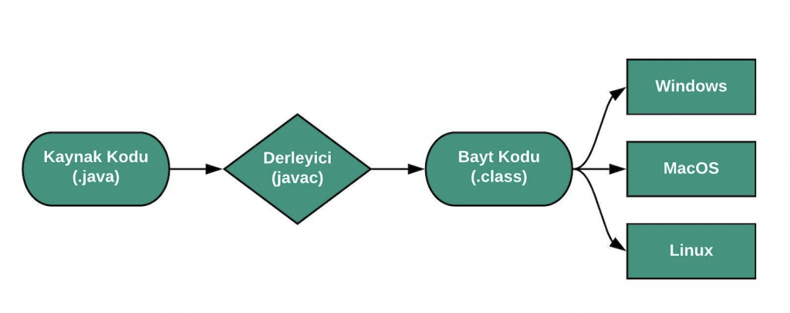
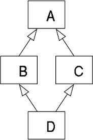

# Java Platform Bağımsızlığını Nasıl Sağlar?

**Java** high-level bir yazılım dilidir, bundan dolayı makine diline çevrilmesi gerekir.

Java derleyicisi, Java programının kaynak kodunu ( .java uzantılı kaynak kod dosyası) derleyen yazılımdır.

Java kodu, önce Java derleyicisi tarafından derlenerek bytecode adı verilen özel bir ara dil haline getirilir.  Bytecode, JVM tarafından yorumlanır ve platform özgü makine koduna çevrilir. Bu sayede, aynı Java programı farklı işletim sistemleri veya platformlar üzerinde çalışabilir.

Kısaca Java, JVM (Java Virtual Machine) üzerinde çalıştığı için platform bağımsız ve taşınabilir bir dildir.

### **JVM (Java Virtual Machine) Nedir ?**

JVM, Java kodunu çalıştırmak için kullanılan bir *sanal makinedir*. Java derleyicisi tarafından derlenen ve bytecode’a çevrilen kaynak kodu yorumlar, platforma özgü makine koduna çevirir. Bu sayede, aynı Java programı farklı işletim sistemleri veya platformlar üzerinde çalışabilir böylelikle Java programı platform bağımsız hale gelir.

### **JRE (Java Runtime Environment) Nedir?**

JRE, Java programını çalıştırmak için gereken temel bileşenleri içeren bir yazılım ortamıdır. JVM’in yürütülmesini, Java standart kütüphanelerine erişimi, çalışma zamanı bileşenlerinin yönetimi ve güvenliğinin sağlanmasını sağlar. Bir Java programını çalıştırmak için JRE’nin sisteminizde yüklü olması gerekmektedir.

### **JDK (Java Development Kit) Nedir?**

JDK, Java programlarının geliştirilmesi ve derlenmesi için kullanılan, hata ayıklaması için gereken araçları içeren bir yazılım paketidir. JDK, geliştiricilere Java platformunu kullanarak uygulamalar oluşturma, derleme, hata ayıklama ve test etme gibi işlemleri gerçekleştirmek için gereken araçları ve kaynakları sağlar.

# Java Neden Çoklu Kalıtım Desteklemez? Hangi Diller Bu Duruma İzin Verir?

Bir class’ın, başka bir class’daki property ve methodlara sahip olmasına kalıtım denir. Çoklu kalıtım ise bir sınıfın birden fazla üst sınıftan miras alabilmesi anlamına gelir. Bu durum bazı problemlere ve karmaşıklıklara yol açabilir.

**Elmas Problemi (Diamond Problem)**

Çoklu kalıtımın en bilinen sorunlarından biri elmas problemidir. Bu problem, bir sınıfın iki farklı sınıftan miras aldığı ve bu iki sınıfın da ortak bir üst sınıfa sahip olduğu durumda ortaya çıkar.

Bu durumda, D sınıfı aynı imzaya sahip bir metodu çağırdığında, B sınıfından mı yoksa C sınıfından mı miras alınan metodu kullanacağı belirsiz hale gelir. 

Java, çoklu kalıtımı tam olarak desteklemez çünkü bu tür belirsizlikler ve karmaşıklıklar, kodun anlaşılabilirliğini ve bakımını zorlaştırır. Bunun yerine, Java çoklu kalıtımın bazı avantajlarını interface'ler üzerinden destekler. Interface'ler, sadece metod imzalarını barındırır ve herhangi bir davranışsal kod içermez. Bu nedenle, bir sınıf birden fazla interface'den türetildiğinde, aynı metod imzasına sahip olsa bile, yalnızca bir kez implementasyon yapılması gerektiğinden herhangi bir sorun yaşanmaz.

C++, Python, Perl ve Lisp, çoklu kalıtımı destekleyen diller arasında yer alır.

# Build Tool Nedir? Java Ekosisteminde Bulunan Tool’lar Nelerdir?

Build Tool’lar yazılım geliştirme sürecinde bağımlılıkları indirme, kodu derleyip paketleme, testleri çalıştırma gibi işlemleri otomatik olarak yapabilmemizi sağlar.

 **Java’da Kullanılan Tool’lar**

- **Apache Maven:**  Java projeleri için bağımlılık yönetimi ve yapılandırma sağlar. XML tabanlı ***pom.xml*** dosyası ile proje yapılandırmasını yönetir.
- **Gradle:** Modern ve esnek bir build . ***build.gradle*** dosyası ile proje yapılandırılır ve bağımlılık yönetimi, derleme, test ve dağıtım işlemlerini otomatikleştirir. Gradle, çoklu proje yapıları için tasarlanmıştır ve yapının hangi bölümlerinin güncel olduğunu belirleyerek artımlı yapıları destekler.
    
    Gradle’ın öne çıkan özelliği, önemli ölçüde daha büyük XML yapılandırma dosyalarına sahip oldukları için Maven ve Ant’a kıyasla çok hafif bir oluşturma aracı olmasıdır.
    
- **Apache Ant:**  XML tabanlı ***build.xml*** dosyası ile yapılandırılır. Eski bir build tool’dur ve genellikle daha basit projelerde kullanılır.