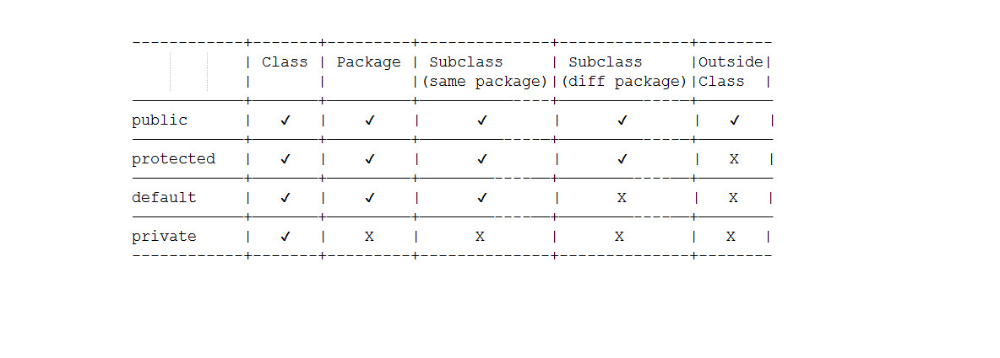
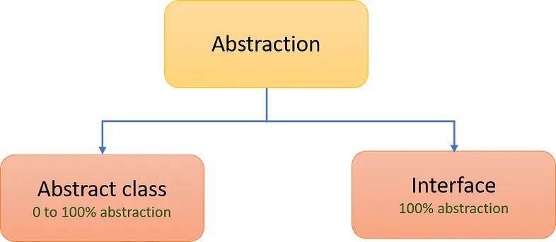

# OOP

**“Gerçek hayatın yazılıma uyarlanması”**

## **CONSTRUCTOR**


Constructor, bir sınıfın nesnelerini oluşturmak ve başlangıç değerlerini atamak için özel bir metoddur. Constructor, sınıfın adıyla aynı olmalıdır ve dönüş tipi yoktur. Java’da bir nesne oluşturulduğunda, constructor otomatik olarak çağrılır ve nesnenin özelliklerine başlangıç değerleri atanır.

```java
public class Ogrenci {
    private String ad;
    private int yas;

    // Constructor
    public Ogrenci(String ad, int yas) {
        this.ad = ad;
        this.yas = yas;
    }

    // Diğer methodlar, özellikler vs. burada tanımlanabilir.
}
```

## **ENCAPSULATION**


Değişkenleri ve bu değişkenlere erişen veya onu değiştiren yöntemleri (metodları) bir sınıfta bir araya getirme ve dışarıdan doğrudan erişimi kısıtlama işlemidir. Bu, veriyi koruma ve kontrol etme amacı taşır.
Sınıfın üye değişkenleri genellikle private erişim belirleyicisi ile tanımlanır, bu da onların sınıf dışından doğrudan erişilememesini sağlar.

```java
public class Ogrenci {
    private String ad;
    private int yas;

    public String getAd() {
        return ad;
    }

    public void setAd(String ad) {
        this.ad = ad;
    }

    public int getYas() {
        return yas;
    }

    public void setYas(int yas) {
        if (yas >= 0) {
            this.yas = yas;
        }
    }
}
```

<p align="center" style="padding: 10px">


## **INHERITANCE**

Nesne Yönelimli Programlama dillerinde kalıtım olgusu, bir sınıfta (class) tanımlanmış değişkenlerin ve/veya metotların (fonksiyon, procedure) yeniden tanımlanmasına gerek olmaksızın yeni bir sınıfa taşınabilmesidir. Bunun için yapılan iş, bir sınıftan bir alt-sınıf türetmektir. Türetilen alt-sınıf (subclass), üst-sınıfta (superclass) tanımlı olan bütün değişkenlere ve metotlara sahip olur. Bu özeliğe kalıtım özeliği (inheritance) denir.

Programcı, yeni alt-sınıfları tanımlarken, üst-sınıftan kalıtsal olarak geleceklere ek olarak, kendisine gerekli olan başka değişken ve metotları da tanımlayabilir.

Bu yolla, bir kez kurulmuş olan sınıfın tekrar tekrar kullanılması olanaklı olur. Böylece, programlar daha kısa olur, programın yazılma zamanı azalır ve gerektiğinde değiştirilmesi ve onarılması (debug) kolay olur.

Java’da bir alt-sınıfın ancak bir tane üst-sınıfı olabilir. Ama bir sınıftan birden çok alt-sınıf türetilebilir.

```java

// Animal sınıfı üst sınıftır
public class Animal {
    private String name;

    // Constructor
    public Animal(String name) {
        this.name = name;
    }

    // Getter for name
    public String getName() {
        return name;
    }

    // Method to make sound
    public void makeSound() {
        System.out.println("Animal makes a sound");
    }
}

// Dog sınıfı, Animal sınıfından kalıtım alır
public class Dog extends Animal {

    private String breed;

    // Constructor
    public Dog(String name, String breed) {
        super(name); // Üst sınıfın constructor'ını çağırır
        this.breed = breed;
    }

    // Method to make sound, overriding the parent class method
    @Override
    public void makeSound() {
        System.out.println("Dog barks");
    }
}
```

## **ABSTRACTION**


Java’da “**abstraction**” veya “**soyutlama**,” bir nesne veya sınıfın detaylarını gizleyerek sadece gerekli olan özellikleri ve işlevleri sunan bir programlama kavramıdır.

Soyutlama, nesne yönelimli programlamanın (OOP) **temel prensiplerinden** biridir ve kodun daha **kaliteli**, **bakımı daha kolay** ve uzun vadede daha **sürdürülebilir** olmasını sağlar. 

Java’da abstraction (soyutlama) iki şekilde yapılır:

<p align="center" style="padding: 10px">


### **Abstract Classes**

- Soyut sınıflar, **tamamlanmış** yöntemlere ve **soyut** (abstract) yöntemlere sahip olabilirler.
- Soyut yöntemler, alt (child) sınıflar tarafından tamamlanması gereken yöntemlerdir.
- ***Bu sınıfların nesneleri oluşturulmaz***, ancak alt (child) sınıflarından türetilen nesneler oluşturulabilir.
- Abstract classların içerisindeki methodlar abstract olabilir veya olmayabilir.
- Java bu kuralı sağlamakta. O yüzden abstract classlarda %100 abstractiondan (soyutlama) bahsedemeyiz.
- Abstract methodların içerisinde constructor tanımlanabilir, çünkü soyut sınıflar bir classdır.

```java
public abstract class Doctor {

    private String name;

    public void muayene(){
        System.out.println("Doktor hastayı muayene eder.");
    }

    // abstract metot sadece abstract classlarda oluşturulur
    // gövdesis metottur.
    public abstract void uzmanlik();

    public void maasZammiHesaplama(Integer mevcutMaas, int calistigiYilSuresi, int zamKatsayisi){
        mevcutMaas = mevcutMaas * calistigiYilSuresi * zamKatsayisi;
        System.out.println(mevcutMaas);
    }
}

public class EyeDoctor extends Doctor{

    // extends edilen abstract classtaki abstract metodu implemen etmek zorundayız.
    @Override
    public void uzmanlik() {
        System.out.println("Uzmanlık alanı gözdür");
    }

    @Override
    public void maasZammiHesaplama(Integer mevcutMaas, int calistigiYilSuresi, int zamKatsayisi){
        mevcutMaas = mevcutMaas * calistigiYilSuresi * (10 /100);
        System.out.println(mevcutMaas);
    }
}
```

### **Interface**

- Interfaceler, bir veya daha fazla soyut yöntemi tanımlayan bir yapıdır.
- Sınıflar interfaceleri uygulayarak bu yöntemleri sağlamak zorundadır.
- Interfaceler, çoklu kalıtımı (multiple inheritance) simüle etmek için kullanılır ve Java’da farklı sınıflar arasında kod paylaşımını kolaylaştırır.
- **Interfaceler bir class değildir**. Bir class yalnızca bir class’ı miras alabildiği için ortaya çıkmış yapılardır. Interfaceler multiple inheritance’a izin veirir.
- Interfaceler içindeki tüm methodlar **tamamlanmamış** (body’si olmayacak şekilde) oluşturulmalıdır.
- Abstract classlarda olduğu gibi interfacelerde de nesne oluşturamayız.
- Interfacelerin içerisinde **constructor tanımlanamaz!**