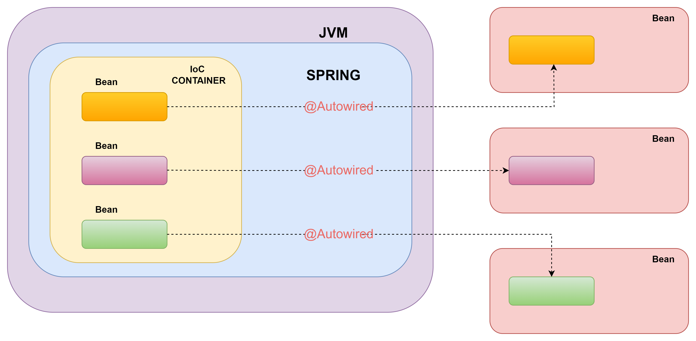

# DEPENDENCY INJECTION 

Dependency Injection (DI), Inversion of Control (IoC)’yi uygulamak için kullanılan bir tasarım modelidir.

IoC, nesne yaratma ve bağımlılıklarını yönetme sorumluluğunu sınıflardan alıp dış bir yapı (IoC Container) tarafından yönetilmesini sağlar.

Dependency Injection, bir nesnenin ihtiyaç duyduğu, bir diğer deyimle bağımlı olduğu nesneleri direkt olarak kendi içerisinde oluşturmak (new) yerine dışarıdan enjekte etmeyi mümkün hale getiren bir programlama tekniğidir. Dependency Injection bağımlılıkları tamamen bitirmez, fakat bir birilerine sıkı bir şekilde bağlı olan (tightly coupled) iki nesne arasındaki ilişkinin daha gevşek bir yapıya (loosely coupled) kavuşmasını sağlar.  Unit testlerin yazımını kolaylaştırırken doğruluğunu da artırır.

**NOT:**  Dependecny Injection kullanmak için class’ların Spring Bean olarak işaretlenmesi gerekir. Class’ları spring bean olarak işaretlemek için @Component anotasyonu, methodlar için de @Bean anotasyonu kullanılır. (Bazı anatasyonlar @Component anatasyonunu içinde barındırıyor. Bu yüzden @Component kullanılmayabiliyor.)

<p align="center" style="padding: 10px">


Dependecny Injection @Autowired anotasyonu ile yapılır. Bir class’ın bağımlılıkları, üç farklı şekilde enjekte edilebilir.

1. Constructor injection
2. Setter Injection
3. Field Injection

## **Constructor Injection**

Bağımlılığın Constructor ile enjekte edilmesidir.

```java
@Component
public class DependencyInjection {

 private final StudentService1 studentService;

 @Autowired  //Spring 4.3 ve sonrası için zorunluluk kalmıştır.
 public DependencyInjection(StudentService1 studentService) {
 this.studentService = studentService;
 }

 }
```

## Setter(Property) Injection

Bağımlılık setter metod üzerinden enjekte edilebilir. 

```java
@Component
public class DependencyInjection {

@Autowired
StudentService studentService;

@Autowired
public void setStudentService(StudentService studentService) {
this.studentService = studentService;
}

}
```

## **Field Injection**

Bağımlılıklar direkt olarak filed üzerinden enjekte edilebilir. (Debug’laması zor oldğu için az tercih ediliyor)

```java
@Component
public class DependencyInjection {

@Autowired
StudentService studentService;

}
```