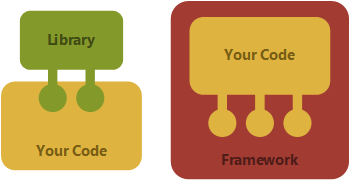

# Library (Kütüphane) Nedir?

Kütüphane önceden yazılmış belirli işlevleri yerine getirmek için kullanılan fonksiyonlar, sınıflar yada diğer bileşenlerdir. Bir projenin geliştirilmesi aşamasında sonradan dahil edilen hazır kodlardır. Kütüphane kullanırken ne zaman çağıracağınız nerede kullanacağınız geliştiricinin kontrolündedir. Kütüphanenin amacı hız ve kolaylık sağlamaktır. Aynı kodların aynı yada farklı projede tekrar tekrar yazılmasını önler.

# Framework (Uygulama Çerçevesi) Nedir?

Framework, belirli bir yazılım geliştirme sürecini düzenleyen ve yönlendiren bir yapı
sunan daha geniş kapsamlı bir araçtır. Frameworkler, belirli bir yapı ve yöntem
sunarak geliştiricilerin projelerini bu yapı ve yöntemler çerçevesinde geliştirmelerini
sağlar. Frameworkler, genellikle belirli bir yazılım mimarisini uygular ve geliştiricilere
temel işlevsellikler, en iyi uygulamalar ve tasarım desenleri sunar.

# Library ve Framework Arasındaki Farklar?

- Kütüphaneler hazır kodlar sunarak projenin geliştirilmesini kolaylaştırır.

- Frameworkler projenin temel yapısını oluşturur.

- Kütüphaneler projeye sonradan dahil edilir.

- Frameworkler projenin temelindedirler.

- Kütüphane kullanırken geliştirici kodun akışını kendi kontrol eder.

- Framework ise
kodun akışını kendisi yönetir.

# Spring Nedir?

Spring, Java tabanlı uygulamalar geliştirmek için kullanılan geniş kapsamlı bir framework'tür. Dependency Injection gibi özelliklere ve Spring JDBC, Spring MVC, Spring Security, Spring AOP, Spring ORM, Spring Test gibi modüllere sahiptir. Esnek ve modüler yapısıyla çeşitli konfigürasyonlar sunar, ancak manuel yapılandırma gerektirir.

# Spring Boot Nedir?

Spring Boot, Spring framework'ü üzerine inşa edilmiştir. Bu nedenle, Spring'in tüm özelliklerini barındırır. Uygulamaları hızlıca geliştirmek için otomatik konfigürasyon, gömülü sunucu, ve starter paketler sunar.  Microservice yazılmasına olanak sağlar.

### **MicroService nedir?**

Çalışan programın ana işlemi üzerindeki yük bölünerek ayrı ayrı işlemlerde çalışmasına ve bu sayede daha performanslı servisler geliştirilebilmesine olanak tanıyan bir yazılım geliştirme mimarisidir. Birlikte çalışabilen, otonom/bağımsız olarak deploy edilebilen belli bir iş sorumluluğu yüklenmiş küçük iş servisleridir. Bu servisler bir biri ile network üzerinden konuşarak anlaşırlar ve bir çok avantajıda yanlarında getirirler.

Diyelim ki bir e-ticaret uygulamanız var ve bu uygulamada kullanıcı yönetimi, ürün katalogu, sipariş yönetimi ve ödeme işlemleri gibi işlevler bulunuyor. Mikroservis mimarisiyle:

- **Kullanıcı Yönetimi Mikroservisi**: Kullanıcı hesapları ve oturum açma işlemlerini yönetir.
- **Ürün Kataloğu Mikroservisi**: Ürünleri listeleyip yönetir.
- **Sipariş Yönetimi Mikroservisi**: Siparişleri işler ve takip eder.
- **Ödeme Mikroservisi**: Ödeme işlemlerini yönetir.

Her bir mikroservis, bağımsız olarak çalışabilir ve diğer mikroservislerle iletişim kurarak birlikte çalışabilir.